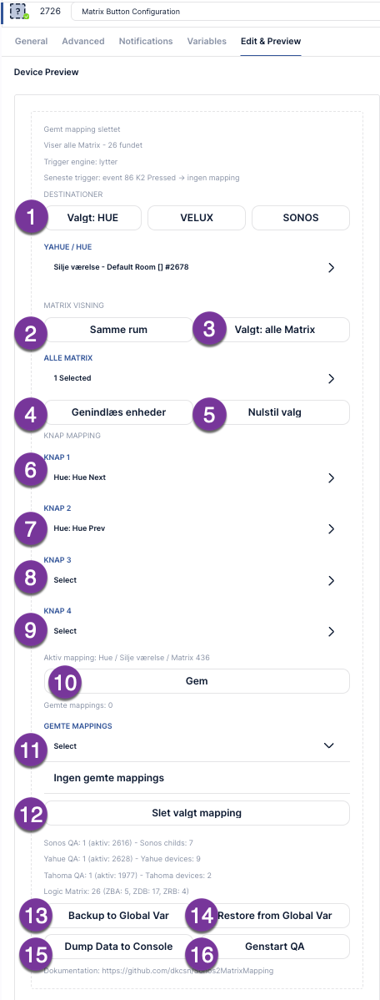

# Matrix Button Configuration

Matrix Button Configuration is a Fibaro HC3 QuickApp used to map Logic Group Matrix wall buttons to actions in other QuickApps.

It currently supports:

- **Sonos:** Sonos Manager / SonosManager Org
- **Hue:** Yahue / Hue
- **Velux:** LogicTahomaSwitch / Velux via Tahoma
- **Matrix:** ZBA7140, ZDB5100, ZRB5120

The QuickApp listens for Matrix **centralSceneEvent** triggers directly inside the QA using **/api/refreshStates**. No Fibaro scenes are required.

## Basic workflow

1. Choose the destination type: **HUE**, **VELUX**, or **SONOS**.
2. Select the target device, for example a Hue lamp, Velux window, or Sonos speaker.
3. Choose **Same room** or **All Matrix**.
4. Select one or more Matrix devices.
5. Choose button mappings for **Knap 1-4**.
6. Press **Gem** to save the mapping.
7. When a Matrix button is pressed, the QuickApp forwards the trigger to the correct target system.

## Numbered controls

**1. Destination selector**  
Choose which system you are configuring: **HUE**, **VELUX**, or **SONOS**.

**2. Same room**  
Shows only Matrix devices in the same room as the selected destination device.

**3. All Matrix**  
Shows all detected Matrix devices, regardless of room.

**4. Genindlæs enheder**  
Reloads Sonos, Yahue/Hue, Tahoma/Velux, and Matrix devices from HC3.

**5. Nulstil valg**  
Clears the current working selection in the UI.

**6-9. Knap 1-4**  
Selects the action profile for each Matrix button.

**10. Gem**  
Saves the current mapping. The mapping becomes active immediately.

**11. Gemte mappings**  
Shows existing saved mappings.

**12. Slet valgt mapping**  
Deletes the mapping currently selected in **Gemte mappings**.

**13. Backup to Global Var**  
Saves all mappings to the global variable **MatrixButtonConfigurationBackup**.

**14. Restore from Global Var**  
Restores mappings from the global variable backup.

**15. Dump Data to Console**  
Writes discovered devices and mappings to the HC3 debug console.

**16. Genstart QA**  
Restarts the QuickApp.

## Supported actions

**Hue / Yahue**

- Toggle light
- Hue Next
- Hue Prev
- Dimming actions, depending on Yahue device support

**Sonos**

- Toggle playback
- Next / Previous
- Source next / previous
- Volume change while holding a Matrix button

**Velux / Tahoma**

- Open
- Close
- Toggle
- Multiple selected windows, for example left and right windows as a pair

## Known issue

HC3 Device Preview dropdowns can sometimes show stale selections. The QuickApp state and debug logs may be correct, while the visible dropdown still shows an old value.

This appears to be an HC3 Device Preview rendering/cache issue with dynamic select/dropdown elements.

**Workarounds:**

- Press **Nulstil valg** before creating a new mapping.
- Switch from **Edit & Preview** to **Variables**, then back again.
- Use **Dump Data to Console** to inspect the actual saved mapping.
- Use **Genstart QA** if the preview becomes confusing.

## Backup recommendation

After creating important mappings, press **Backup to Global Var**. This makes it easier to restore your configuration if the QA is replaced, reinstalled, or upgraded.
